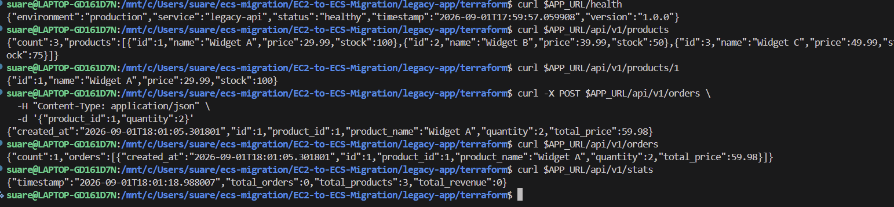

# Dev Test Screenshots

The legacy API returns products and creates an order, but statistics disagree with the orders response.

Repeated product requests return stock values of both 100 and 98, showing inconsistent state between requests.
