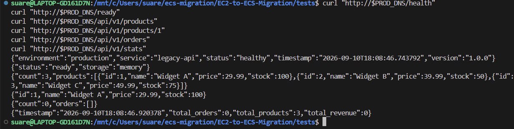
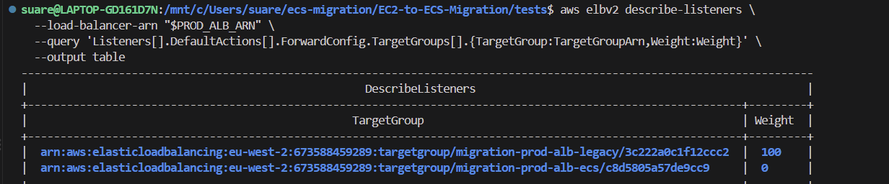
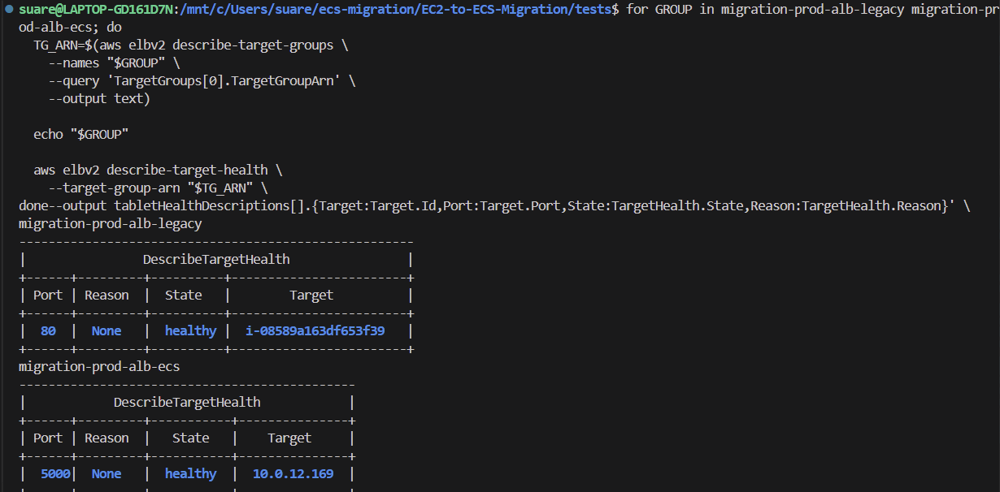
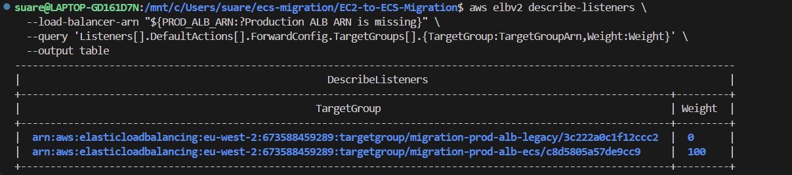
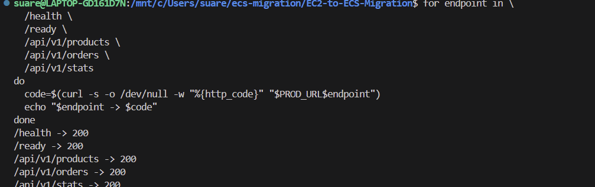

# Production Test Screenshots

## Pre-cutover

Tests the production API before cutover, with `/ready` confirming the legacy in-memory backend.

Confirms the production listener routes 100% of traffic to legacy EC2 and 0% to ECS before cutover.

Confirms both the legacy EC2 and ECS target groups have healthy targets before switching traffic.

## Post-cutover

Confirms the production listener routes 100% of traffic to ECS and 0% to legacy EC2 after cutover.

Confirms `/health`, `/ready`, `/api/v1/products`, `/api/v1/orders` and `/api/v1/stats` return HTTP 200 after cutover.
