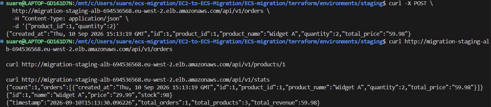
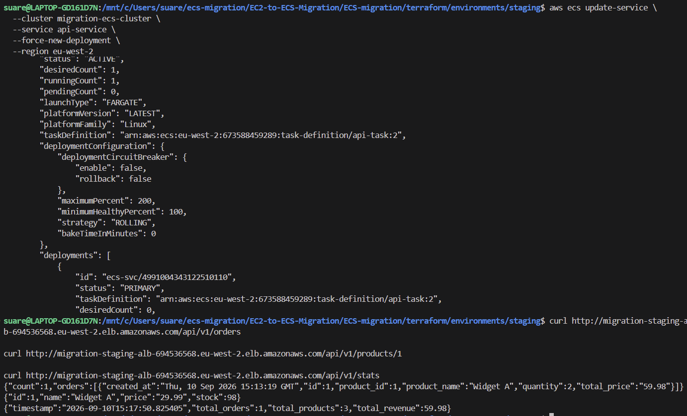
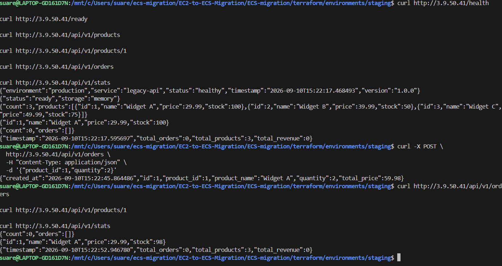

# Staging Test Screenshots

Tests ECS application health and readiness to use the PostgreSQL database.

Tests order creation, order retrieval, stock updates and statistics using the ECS API backed by RDS.

Tests whether orders, stock and revenue stored in RDS persist across an ECS redeployment.

Tests order creation, order retrieval, stock updates and statistics using the legacy EC2 API with in-memory storage.

Tests whether restarting the legacy EC2 application loses in-memory orders and resets product stock.

