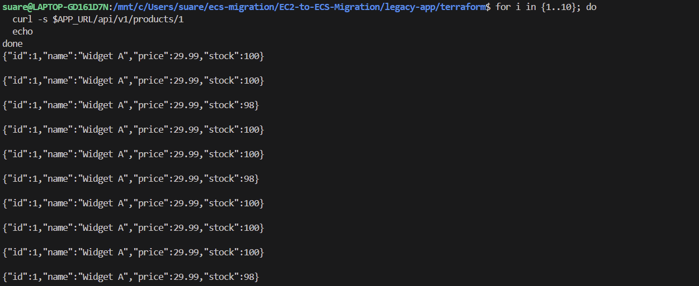

# EC2 to ECS Fargate Migration

## Overview

This project documents the migration of a legacy Python/Flask ordering API running on a single Amazon EC2 instance to a production-style, containerised platform using Amazon ECS with AWS Fargate.

The migration is being approached as an infrastructure modernisation rather than simply redeploying the application. The existing environment is first deployed, tested and assessed so that its behaviour and limitations are understood before changes are introduced.

**Understand the existing environment → establish a working baseline → containerise the application → externalise application state → build the ECS platform → introduce CI/CD and observability → validate the new environment → safely cut traffic from EC2 to ECS.**

The target is to improve availability, scalability, security, deployment safety, observability and operational consistency while preserving the application's expected behaviour.

## What the Legacy API Does

The legacy workload is a small product and ordering API written in Python using Flask and served by Gunicorn behind Nginx.

It exposes endpoints that allow clients to:

- Check application health with `GET /health`
- List available products with `GET /api/v1/products`
- Retrieve an individual product with `GET /api/v1/products/{id}`
- Create an order with `POST /api/v1/orders`
- Retrieve existing orders with `GET /api/v1/orders`
- View basic application statistics with `GET /api/v1/stats`

The application begins with three products held in memory. Creating an order records the order, calculates its total price and reduces the available stock for the selected product.

This deliberately simple application allows the project to focus on the infrastructure and migration concerns around running a stateful legacy workload reliably in a modern container platform.

## Project Goals

The final platform will migrate the Flask application from EC2 to **Amazon ECS using AWS Fargate**, removing the need to directly manage application servers.

The project aims to implement:

- Docker containerisation of the Flask application
- Amazon ECR for container image storage
- Amazon ECS using the Fargate launch type
- Application Load Balancer for application traffic
- ECS services and task definitions
- Multi-AZ networking
- Public and private subnet separation
- Security groups following least-privilege principles
- Infrastructure as Code using Terraform
- Amazon RDS PostgreSQL for shared persistent application state
- AWS Secrets Manager for secure database credentials
- Automated CI/CD using GitHub Actions and AWS OIDC
- Centralised application logging using Amazon CloudWatch
- ECS service health checks
- Horizontal application scaling
- Deployment rollback capability
- A controlled EC2 → ECS production cutover strategy

## Legacy Architecture

The starting environment consists of a Python Flask API running on a single EC2 instance.

Terraform provisions the AWS infrastructure. During EC2 startup, user data retrieves the application package from Amazon S3 and configures the host. Nginx accepts incoming HTTP traffic and proxies requests to Gunicorn, which runs the Flask application.

```text
Client
  |
  v
EC2 Public Endpoint
  |
  v
Nginx :80
  |
  v
Gunicorn :5000
  |
  v
Flask API
```

The application currently stores products, stock levels and orders directly in Python process memory.

## Current Progress

### Phase 1 — Repository Setup

Completed:

- Created the migration repository
- Added the inherited application under `legacy-app/`
- Verified that the legacy application files are correctly tracked by Git
- Removed unnecessary training and assignment references
- Established the repository as the working location for the migration
- Pushed the repository to GitHub

### Phase 2 — Legacy EC2 Deployment

The inherited Terraform configuration was reviewed and used to reproduce the existing EC2 environment.

The deployment flow is:

```text
Terraform Apply
      |
      v
AWS infrastructure provisioned
      |
      v
EC2 instance launched
      |
      v
User data executed
      |
      v
Application retrieved from S3
      |
      v
Python/Gunicorn + Nginx configured
      |
      v
Legacy API available
```

The Terraform deployment completed successfully and the API became accessible through the EC2 public endpoint.

## Legacy Application Baseline Validation

Before making any migration changes, the existing application was tested to establish a known-good functional baseline.

The following functionality was successfully validated:

| Test | Result |
| --- | --- |
| `GET /health` | Healthy response returned |
| `GET /api/v1/products` | Three products returned |
| `GET /api/v1/products/1` | Individual product returned |
| `POST /api/v1/orders` | Order successfully created |
| `GET /api/v1/orders` | Created order returned |
| `GET /api/v1/stats` | Order count and revenue calculated |

During testing, an order for two units of **Widget A** was successfully created. The API returned order ID `1`, quantity `2`, and a calculated total price of `59.98`. The orders endpoint subsequently returned the created order and the statistics endpoint reported one order and total revenue of `59.98`.

### Successful API Validation

The following terminal output captures the baseline API tests against the running EC2 deployment:


This confirms that the existing request path is operational before migration work begins:

```text
Client → EC2 → Nginx → Gunicorn → Flask
```

## Baseline Finding — Inconsistent In-Memory State

Baseline testing exposed an important reliability issue in the legacy application.

After creating an order for two units of Widget A, the product stock should have changed from `100` to `98`. A subsequent request, however, returned a stock value of `100`.

Repeated requests to the same endpoint confirmed that responses alternated between `100` and `98`:



### Root Cause

The application stores its product and order data in Python variables inside the application process. Gunicorn runs multiple worker processes, and those workers do not share Python process memory.

As a result, each worker can maintain a different copy of the application's state:

```text
                     Nginx
                       |
                       v
                    Gunicorn
                /       |       \
               v        v        v
           Worker 1  Worker 2  Worker 3
           stock=98  stock=100 stock=100
```

An order handled by one worker modifies only that worker's copy of the data. A later request handled by another worker can therefore return a different stock level or order state.

This means the legacy application has a data consistency problem **even while running on a single EC2 instance**. Restarting a worker or the instance would also remove the in-memory order data entirely.

## Migration Decision — Externalise Application State

This baseline finding changes an important part of the target architecture.

Simply placing the existing application into multiple ECS tasks would make the problem worse because every task would maintain its own independent state.

The migration will therefore externalise application data to **Amazon RDS for PostgreSQL**. Database credentials will be stored in **AWS Secrets Manager** rather than embedded in application configuration.

```text
Legacy

Gunicorn Worker 1 ──→ Local process memory
Gunicorn Worker 2 ──→ Different process memory
Gunicorn Worker 3 ──→ Different process memory

                    ❌ inconsistent and non-persistent

Target

ECS Task 1 ─┐
ECS Task 2 ─┼──→ Amazon RDS PostgreSQL
ECS Task 3 ─┘             |
                           v
                   Shared persistent state

                            ✅
```

This gives all running ECS tasks a single durable source of truth for products, stock and orders and allows tasks to be replaced or horizontally scaled without losing application data.

## Phase 3 — Docker Containerisation

The legacy Flask application has now been containerised and validated locally before any ECS resources are introduced. This keeps the migration incremental: first prove that the application behaves correctly inside a container, then move that known-good image into ECR and ECS.

The container image uses `python:3.9-slim` as its base image. The slim variant provides the required Python runtime while avoiding the additional packages included in larger general-purpose images. This keeps the image smaller, reduces unnecessary dependencies and lowers the overall attack surface.

The application is copied into `/legacy-app`, which is set as the container working directory. Python dependencies are installed from `requirements.txt`, port `5000` is documented as the application port, and Gunicorn is used as the production WSGI server.

```text
Docker Container
      |
      v
Gunicorn :5000
      |
      v
wsgi.py
      |
      v
Flask Application
```

### Why a Single-Stage Build Was Used

A multi-stage Docker build was considered but was not required for this workload.

The application is a small Python/Flask service with no separate compilation step, frontend asset build, or build-time toolchain that needs to be excluded from the final image. Its containerisation process is simply:

```text
Python slim base image
        |
        v
Copy application source
        |
        v
Install Python dependencies
        |
        v
Run Gunicorn
```

Introducing an additional build stage would therefore add complexity without providing a meaningful reduction in the runtime image. Using the official `python:3.9-slim` base image already provides a lightweight foundation for the service.

If future dependencies require compilers, development headers or other temporary build tooling, a multi-stage build can be introduced so those tools remain outside the final runtime image.

### Production Application Server

The application includes both Flask's built-in development server and a WSGI entry point for Gunicorn.

The container does not start the application using `python app.py`, because that would run Flask's development server. Instead, Gunicorn loads the Flask application through `wsgi.py` and listens on all container network interfaces on port `5000`.

```text
Gunicorn
   |
   v
wsgi:app
   |
   v
Flask API
```

This preserves the production serving model used by the legacy application while removing the dependency on the EC2 host.

### Container Security

The runtime container follows the principle of least privilege.

A dedicated non-root user named `legacyuser` is created during the image build. Image setup and Python dependency installation are completed first, after which the container switches to `legacyuser` before Gunicorn is started.

This means the application process does not run as root inside the container.

```text
Image build/setup
      |
      v
root
      |
      v
Dependencies installed
      |
      v
USER legacyuser
      |
      v
Gunicorn / Flask runtime
```

The application source remains readable by the runtime user without granting unnecessary write privileges to the application files.

The runtime identity was explicitly verified after starting the container:

```text
docker exec legacy whoami
legacyuser
```

This confirms that the non-root security configuration is effective rather than only being declared in the Dockerfile.

### Docker Build Context Security

A `.dockerignore` file was added to prevent files that are not required for the application image from being included in the Docker build context.

Excluded content includes:

- Git metadata
- Documentation and screenshots
- Legacy Nginx and systemd configuration
- Legacy Terraform infrastructure files
- Terraform state and backup state files
- Python cache files
- Local environment files and private key formats
- IDE and operating-system metadata

This is particularly important because Terraform state and local environment files can contain sensitive infrastructure or configuration data.

The build therefore uses two controls:

```text
.dockerignore
      |
      v
Restrict build context
      |
      v
COPY legacy-app/app /legacy-app
      |
      v
Only application files enter the image
```

### Local Container Validation

The image was successfully built and started locally with host port `5000` mapped to container port `5000`.

The running container showed the expected mapping:

```text
0.0.0.0:5000 -> 5000/tcp
```

The following API checks were then successfully completed against the containerised application:

| Test | Result |
| --- | --- |
| `GET /health` | Healthy production response returned |
| `GET /api/v1/orders` | Orders endpoint responded successfully |
| `GET /api/v1/stats` | Application statistics returned successfully |
| Runtime user check | Container confirmed to run as `legacyuser` |

The health endpoint returned the service as healthy with the environment reported as `production`, confirming that Gunicorn successfully loaded and served the Flask application inside the container.

At this point the workload has been successfully moved from a host-dependent application deployment into a repeatable Docker image while preserving its API behaviour.

The next container platform milestone is to store the validated image in **Amazon ECR** before introducing the ECS Fargate service.

## Legacy Limitations Identified

The baseline assessment has now identified the following production concerns:

- Single EC2 application host and single point of failure
- No application-level autoscaling
- Application hosted directly on a publicly reachable server
- Server-based deployment and configuration
- No automated CI/CD pipeline
- Limited deployment rollback capability
- Logs distributed across the EC2 host
- Limited application-level monitoring and alerting
- Product and order state stored in process memory
- State is inconsistent between Gunicorn workers
- Application state is lost when processes restart
- Current state model cannot safely support horizontal scaling

These findings form the engineering justification for the ECS migration rather than introducing services purely for architectural complexity.

## Target Architecture

The target platform will replace the EC2-hosted workload with containerised ECS tasks running on AWS Fargate and shared persistent storage in RDS.

```text
                         Internet
                            |
                            v
                       Route 53
                            |
                            v
                 Application Load Balancer
                            |
                            v
                       ECS Service
                       /         \
                      v           v
                Fargate Task   Fargate Task
                      \           /
                       \         /
                        v       v
                    RDS PostgreSQL
                         ^
                         |
                  Secrets Manager
```

Container images will be stored in Amazon ECR and deployments will be automated through GitHub Actions using AWS OIDC rather than long-lived AWS credentials.

Terraform will manage the AWS infrastructure, while CloudWatch will provide centralised logs, metrics, dashboards and alarms.

The EC2 environment will remain available during migration validation so that the ECS environment can be tested in parallel and traffic can later be moved using a controlled cutover and rollback strategy.
