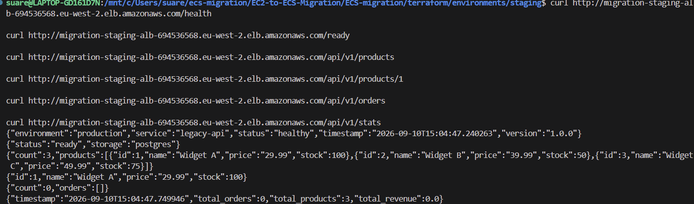
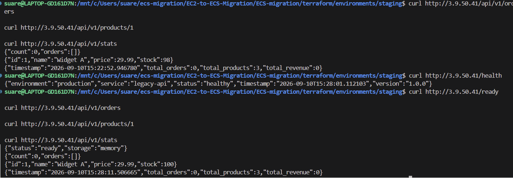
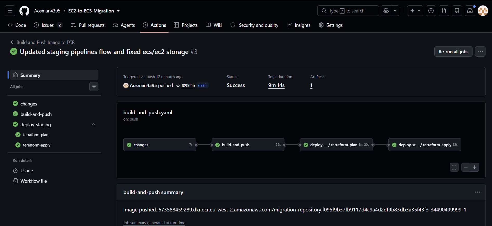

# Migration Test Evidence

This folder contains screenshots from the main validation tests used during the EC2 to ECS migration.

## ECS Health and Readiness



The ECS application is healthy behind the ALB and `/ready` confirms the PostgreSQL storage backend is available.

## ECS RDS API Test


An order was created successfully. Widget A stock changed from `100` to `98` and total revenue became `59.98`.

## ECS Persistence Test


After forcing a new ECS deployment, the order, stock value and revenue remained. This confirms application state is persisted in RDS and survives ECS task replacement.

## Legacy EC2 Memory Test


The legacy EC2 application uses the memory storage backend. The API can create an order and change stock while the application is running.

## Legacy EC2 Restart Test



After manually rebooting EC2, the order was lost and Widget A returned to stock `100`. This confirms the legacy application's in-memory state is not persistent.

## Staging CI/CD Pipeline



The application-change pipeline completed successfully through change detection, image build/push, Terraform plan and Terraform apply.

## Result

```text
Legacy EC2 + memory  -> restart -> state lost
ECS Fargate + RDS    -> new task -> state retained
```
